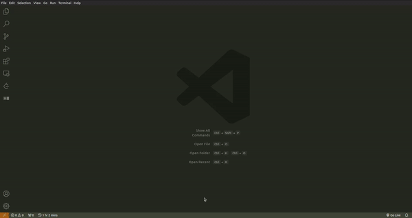
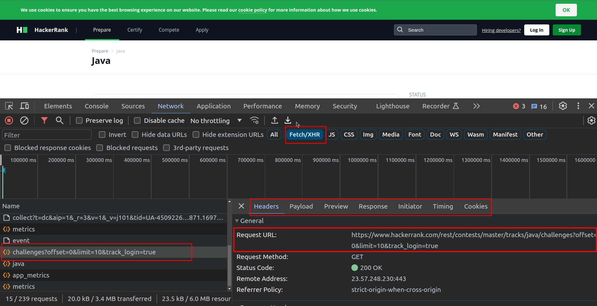
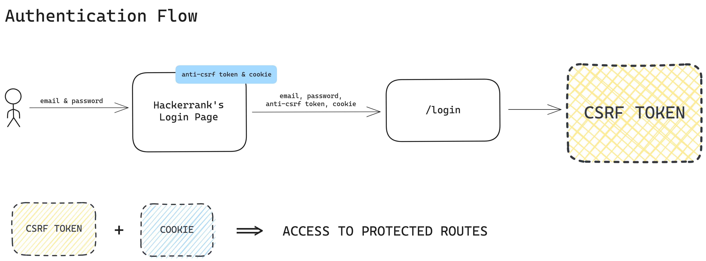
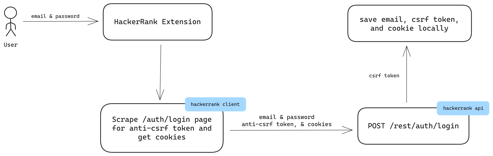

# <center> HackerRank + VS Code </center>


### <center> HackerRank + VS Code lets you solve HackerRank challenges in VS Code </center>

<center>


</center>
<br>

## 0. Table of Contents

1. [Overview]()
2. [Install]()
3. [Usage]()
4. [HackerRank provides an API for developers, right?]()
   - [I used HackerRank's internal API]()
   - [But what about protected routes?]()
   - [Authentication and mitigation of CSRF attacks]()
   - [How the extension authenticates the users?]()
   - [Authentication flow in the extension]()
5. [Where does the user data go?]()
   - [What is .hackerrankrc?]()
   - [Where does the code I write go?]()
6. [Current Release]()
7. [Future Release Ideas]()
8. [Contributing]()
9. [References]()

## 1. Overview

This project was an attempt to bring Hackerrrank into our good old VS Code as an extension. This extension allows us to leverage the in-built debugging tools, version control system, and infinite customizability of VS Code.

Hackerrank does not come with debugging tools and neither has direct integration with Github for version control. Snippet support is not very flexible. Most of the developers are much more adept at VS Code and would rather prefer coding here than on the hackerrank platform. This is where this extension comes in!

<br>



## 2. Install

1. Clone the repository locally

```bash
git clone https://github.com/Suyash-Purwar/hackerrank-vscode.git
```

2. Move inside the folder and open VS Code

```bash
cd hackerrank-vscode && code .
```

3. Press 'F5' to start the debugger. A new VS Code window will open with the extension running.

## 3. Hackerrank provides an API for developers, right?

### 3.1 I used HackerRank's Internal API. Here's how.

Hackerrank does not provide any out-of-the-box API to access its platform's capabilities. I had to resort to browser inspection tools to identify what calls were being made for which data. This way I figured out the API endpoints, request and response headers, and request and response payload format.

For example, to detect an API endpoint for fetching all the challenges for a specific topic, say Java, here's how I found the endpoint.

1. Open your browser and press F12 to open developer tools. Go to the network tab.

2. Now, open the page for which you want to see network calls. In my case, it's `hackerrank.com/domain/java`.

3. A bunch of network calls will appear. In my case, we are just looking for Fetch/XHR API calls. In the below image, I have set up a filter to show only those requests.

4. This filter shortens our list of network calls. Now, we just need to explore these calls. With some exploration, it becomes clear which call is for what. Here, the '/challenges' endpoint is of interest to us.

5. Upon selecting a particular call, another pain opens which contains details for that particular call. The Header, Payload, Response, and Cookie tabs can tell us the whole anatomy of the call.
   <br>



### 3.2 But what about protected routes?

My initial idea was to collect the user's email and password, and then make a POST request to the /login endpoint. I would then store the received cookie locally. To access any protected routes, I would simply utilize this cookie. This did not work as HackerRank’s authentication flow is not so straightforward.

HackerRank has a security measure in place to prevent CSRF attacks. This security measure presented challenges in accessing the protected routes. Before moving further, it’s essential to understand how HackerRank authenticates the users and how it became a problem for me to use the cookies.

### 3.3 Authentication and prevention from CSRF attacks

Hackerrank utilizes CSRF tokens to prevent CSRF attacks. While my application does not carry out CSRF attacks, this security measure presented challenges in accessing the protected routes.

It's important to understand how Hackerrank authenticates its users. The steps are described below:

1. Hackerrank's login page has an csrf token embedded in its HTML page, and cookies are also returned.
2. When the user provides their email and password, a POST request is made to the `/login` page with the user credentials, csrf token, and cookies.
3. After successful authentication, a new csrf token is returned. This token is used in conjunction with cookies to access the protected routes.

Based on my personal analysis, it appears that the generated CSRF token is mapped with the cookies and remains valid as long as the cookie is valid. The cookie is returned prior to user authentication but only after a successfull authentication it is mapped to a particular user.

Below is a pictorial representation of how authentication takes place.



### 3.4 How the extension authenticates the users?

Initially, I wasn't sending `X-Csrf-Token` header in the `/login` request as I was unaware that it needs to be sent as well. What contributed even more in this doubt was, that HackerRank was authenticating the user and returning an **invalid** token instead of rejecting the request altogether.

Once I figured that `X-Csrf-Token` header is needed, the next challenge was to figure out where this token is embedded in the page. Generally, it's embedded in the form as a hidden field but there was nothing other than the usual stuff. So, I was again stuck for 2-3 days.

I eventually found it in the `meta` tag. I wrote a simple script to scrape it out before initiation user authentication. With this token, cookie, and user credentials, I was getting the valid token back.

### 3.5 Authentication flow in the extension

1. Take user email and password. Demo of it can be seen in the GIF at the top.
2. Make a GET request to the `hackerrank.com/auth/login` and scrape the csrf token and get the cookies too.
3. Make a POST request to the `hackerrank.com/rest/auth/login` with email and password in the request body, cookies and `X-Csrf-Token` header set to the csrf token obtained in the 2nd step.
4. Upon successful authentication, a new csrf token is returned.
5. Save the email, cookies and the newly generated csrf token locally.

Tokens and cookies will be read from the file system to make a request to the protected routes.


